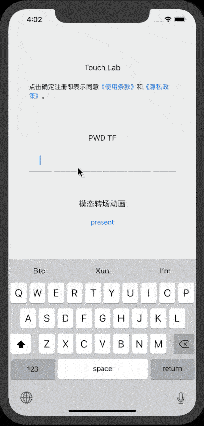

# DevTool

[](https://travis-ci.org/lx-xi/XDevTool)
[](https://cocoapods.org/pods/XDevTool)
[](https://cocoapods.org/pods/XDevTool)
[](https://cocoapods.org/pods/XDevTool)

## Example

To run the example project, clone the repo, and run `pod install` from the Example directory first.



## Requirements

## Installation

XDevTool is available through [CocoaPods](https://cocoapods.org). To install
it, simply add the following line to your Podfile:

```ruby
pod 'XDevTool'
```

## Author

muxilx@163.com

## License

XDevTool is available under the MIT license. See the LICENSE file for more info.
